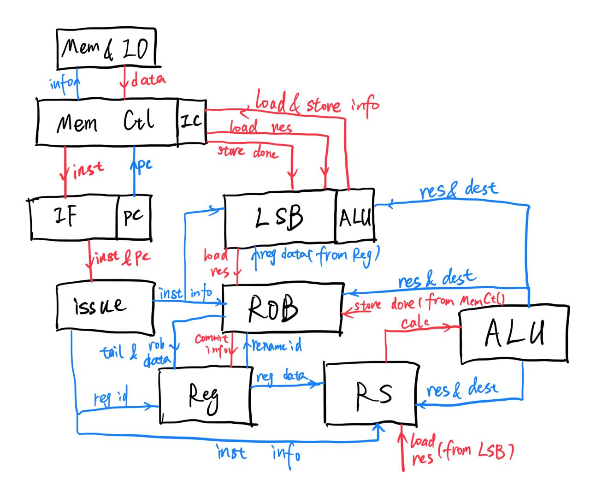

#  RISCV-CPU 2022

## 项目说明

使用 Verilog 语言完成一个简单的 RISC-V CPU 电路设计，并通过软件仿真和 FPGA 板两种方式的测试运行。

## 总体框架

采用Tomasulo算法进行乱序执行，具体如下：

* 红线为时序，随时钟变化；蓝线为组合，直接计算得到。
* 部分线没有画出，比如`jal reset`以及`io_buffer_full`等线。

### 一些细节

* `MemCtl`与`Mem`的交互采用了组合，在加上`io_buffer`的限制之后需要将`hci`中的输出部分改成时序逻辑，否则可能会出现多次输出的情况
* `rd[0]`的值应该一直是`0`，所以赋值以及`renaming`不需要考虑
* input(`0x30000`)时要等到`rob`也执行到这条指令时才能执行，否则可能会造成input数据的流失(比如jal的reset)
* `io_buffer`满的时候要把`lsb`和`rob`停住
* 上板前注意好`io_buffer`、初始化以及锁
* ...

